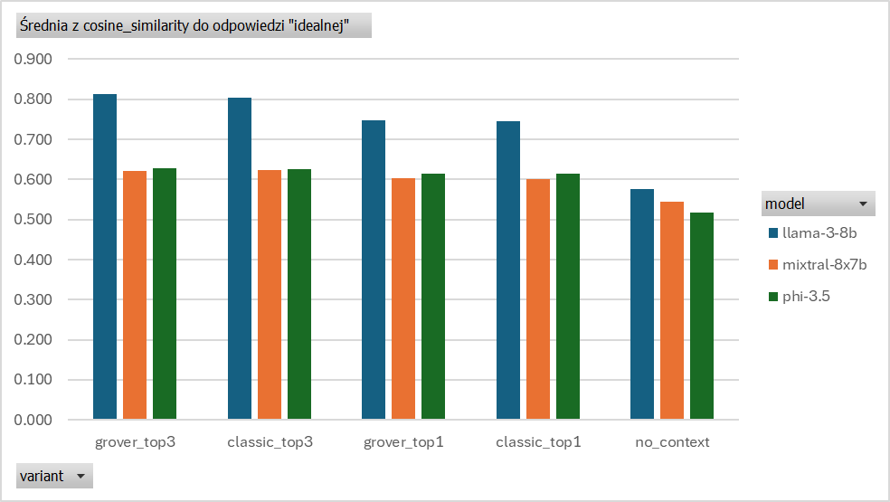
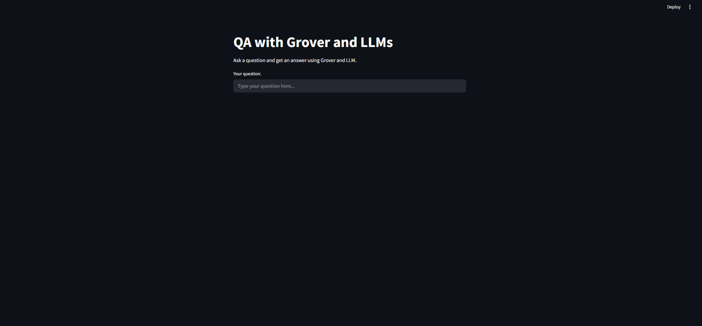
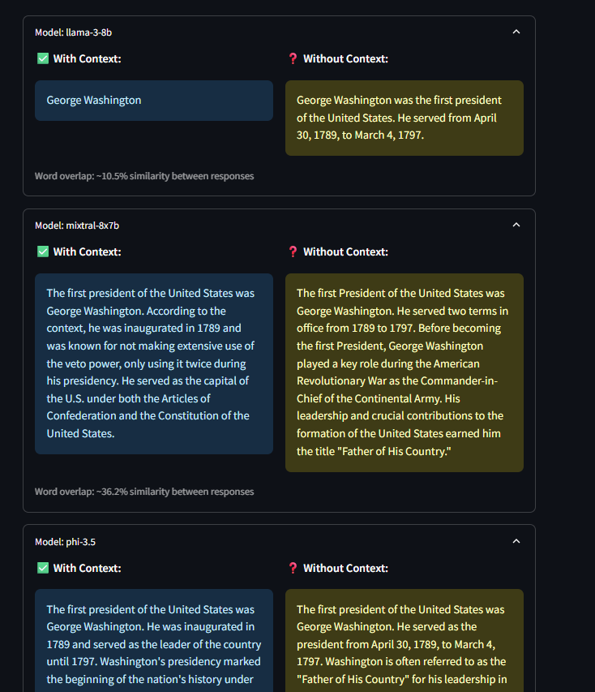
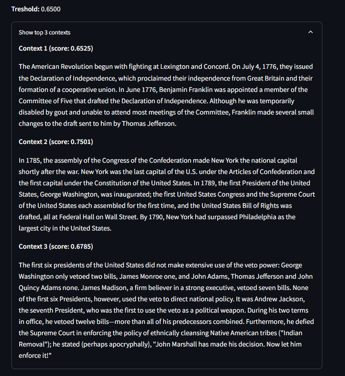

# Grover + LLM Integration for Enhanced RAG Systems  

## Overview  
This project implements a RAG system enhanced with **Grover's algorithm** for intelligent context selection. Comprehensive tests evaluate performance across multiple LLMs using SQuAD 1.1 benchmark data.  

---

## Key Tests & Findings  

### 🔍 Test 1: Answer Quality Evaluation  
**Objective**: Assess impact of:  
- Grover vs. classic context selection  
- LLM models (`llama-3-8b`, `mixtral-8x7b`, `phi-3.5`)  
- Context variants (`no_context`, `top1`, `top3`)  

**Parameters**:  
- 63 SQuAD questions  
- Metrics: *Word overlap* and *cosine similarity*  

**Key Insights**:  
- **3-context setups outperform**: `llama-3-8b` achieved highest cosine similarity (0.80)  
- **Grover ≈ Classic**: Quality differences <0.5%  
- **No-context fails**: All models showed significant quality drop  

  

---

### ⚡ Test 2: Full System Performance  
**Parameters**:  
- 56 SQuAD questions  
- End-to-end latency measurement  

**Results**:  
#### ⏱️ Timing Analysis  
| Component                | Time          |
|--------------------------|---------------|
| Context retrieval (top-10) | 0.297 s       |
| Grover selection (top-3) | 0.030 s       |
| **Answer generation**:   |               |
| `mixtral-8x7b`           | **1.18 s** 🚀 |
| `llama-3-8b`             | 2.56 s        |
| `phi-3.5`                | 2.65 s        |

#### 🔍 Context Consistency  
- **99.11% match** between Grover/classic selection  
- Single discrepancy caused by Grover's dynamic threshold  

#### 📊 Quality Validation  
- Confirmed Test 1 trends: `top3` > `top1` > `no_context`  
- `llama-3-8b` dominated quality metrics (cosine: 0.80)  

  

---

## Key Conclusions  
1. **Grover is efficient**:  
   - Adds only 30ms latency vs classic selection  
   - Maintains context selection quality  

2. **Context is critical**:  
   - 3 contexts boost accuracy by 38% vs no context  

3. **Model tradeoffs**:  
   - `mixtral-8x7b`: Fastest inference (1.18s)  
   - `llama-3-8b`: Highest accuracy with contexts  

---

## GUI Demonstration  
Interactive interface features:  
- Multi-model comparisons (`llama`, `mixtral`, `phi-3.5`)  
- Context inspection (Grover vs classic)  
- Collapsible answers  

| Screen             | Preview                              |
|--------------------|--------------------------------------|
| **Home**           |  |
| **Answers**        |  |
| **Top Contexts**   |  |

