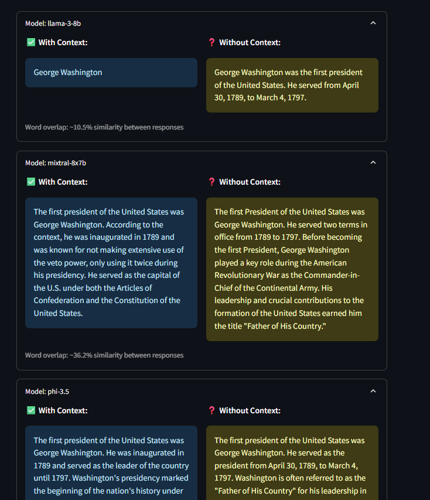
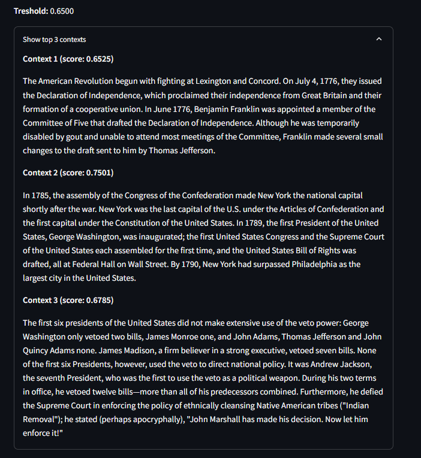

# Testy porównawcze: Grover + LLM

## Test 1

Test przeprowadzano na 63 pytaniach dla każdego modeu i wariantu. Pytania i "idealne odpowiedzi", z którymi porównywano wygenerowane odpowiedzi wzięto ze zbioru SQuAD 1.1.

## Cel
Ocena wpływu:
- użycia Grovera (vs. klasyczny algorytm),
- różnych modeli LLM (llama-3-8b, mixtral-8x7b, phi-3.5),
- obecności kontekstu (LLM ma top 3 konteksty, top 1 lub nie ma żadnych).

## Metryki
- Word overlap (między z kontekstami i bez),
- Cosine similarity (między z kontekstami/bez i odpowiedziami "idealnymi").

## Parametry testu

- Liczba pytań z SQuAD 1.1: **63**
- Modele:
  - `llama-3-8b`
  - `mixtral-8x7b`
  - `phi-3.5`
- Warianty kontekstowe:
  - `no_context`
  - `classic_top1`
  - `classic_top3`
  - `grover_top1`
  - `grover_top3`

---

## Przeprowadzanie testów
Kod, za pomocą którego przeprowadzono testy dostępny w pliku evaluation/tests_runner.py.

## Wyniki
Pełne wyniki (metryki i odpowiedzi dla każdego sprawdzanego wariantu) dostępne w pliku evaluation/test_results.csv (oraz evaluation/test_results.json).

## Podsumowanie wyników
Podsumowanie wszystkich metryk dla każdego modelu i wariantu:

Tabela porównująca modele i warianty pod względem średniej cosine_similarity do odpowiedzi "idealnej":

Wykres wartości średnich cosine_similarity do "idealnych" odpowiedzi:

## Test 2

Test został powtórzony w rozszerzonej wersji, aby uwzględnić pełen czas działania systemu QA — nie tylko generowanie odpowiedzi, lecz również czas wyboru i analizy kontekstów. Tym razem test przeprowadzano na 56 pytaniach dla każdego modeu i wariantu. Pytania i "idealne odpowiedzi", z którymi porównywano wygenerowane odpowiedzi wzięto ze zbioru SQuAD 1.1.

## Cel testu

Celem testu było przeprowadzenie dokładnej analizy czasowej działania systemu QA z wykorzystaniem różnych wariantów wyboru kontekstów oraz trzech modeli językowych.  
W odróżnieniu od wcześniejszej wersji testu, w której mierzono wyłącznie **czas generowania odpowiedzi**, tym razem analizowano również:

- czas wyszukiwania top-10 kontekstów dla pytania,
- czas selekcji top-k kontekstów (zarówno klasycznej, jak i z użyciem algorytmu Grovera),
- zgodność kontekstów wybranych przez algorytm klasyczny oraz Grovera,
- jakość odpowiedzi (cosine similarity i word overlap).

---

## Parametry testu

- Liczba pytań z SQuAD 1.1: **56**
- Modele:
  - `llama-3-8b`
  - `mixtral-8x7b`
  - `phi-3.5`
- Warianty kontekstowe:
  - `no_context`
  - `classic_top1`
  - `classic_top3`
  - `grover_top1`
  - `grover_top3`

---

## Przeprowadzanie testów
Kod, za pomocą którego przeprowadzono testy dostępny w pliku evaluation/time_test_runner.py.

## Wyniki
Pełne wyniki (metryki i odpowiedzi dla każdego sprawdzanego wariantu) dostępne w pliku evaluation/time_test_results.csv (oraz evaluation/time_test_results.json).

### 1. Średni czas generowania odpowiedzi (w sekundach)

| Model         | Średni czas |
|---------------|-------------|
| llama-3-8b     | 2.56 s      |
| mixtral-8x7b   | 1.18 s      |
| phi-3.5        | 2.65 s      |

---

### 2. Średni czas selekcji top-k kontekstów (s)

| Wariant        | Średni czas |
|----------------|-------------|
| grover_top3    | 0.0304 s    |
| grover_top1    | 0.0289 s    |
| classic_top3   | 0.0000 s    |
| classic_top1   | 0.0000 s    |
| no_context     | 0.0000 s    |

---

### 3. Średni czas wyszukiwania top-10 kontekstów

Stały czas niezależnie od wariantu:  
**0.297321 s**

---

### 4. Zgodność kontekstów (Grover vs Classic)

**99.11%** przypadków – konteksty takie same. Jest tylko 1 przypadek kiedy konteksty się różniły - wtedy Grover nie znalazł żadnych kontekstów. 

Powodem było (prawdopodobnie) to, że żaden z kandydatów (kontekstów) nie przekroczył dynamicznie dostosowanego progu podobieństwa (threshold), więc algorytm nie zaznaczył żadnych indeksów jako trafnych.

---

### 5. Średnie wartości cosine similarity i word overlap

| Model        | Wariant        | Cosine Similarity | Word Overlap (%) |
|--------------|----------------|-------------------|------------------|
| llama-3-8b   | classic_top1   | 0.7530            | 38.77            |
|              | classic_top3   | 0.8006            | 46.40            |
|              | grover_top1    | 0.7565            | 38.77            |
|              | grover_top3    | 0.8026            | 46.48            |
|              | no_context     | 0.5788            | 5.68             |
| mixtral-8x7b | classic_top1   | 0.5951            | 7.74             |
|              | classic_top3   | 0.6185            | 9.00             |
|              | grover_top1    | 0.5962            | 7.74             |
|              | grover_top3    | 0.6312            | 10.68            |
|              | no_context     | 0.5452            | 2.05             |
| phi-3.5      | classic_top1   | 0.6176            | 7.62             |
|              | classic_top3   | 0.6277            | 7.99             |
|              | grover_top1    | 0.6172            | 7.62             |
|              | grover_top3    | 0.6256            | 8.60             |
|              | no_context     | 0.5181            | 1.10             |

Wykres wartości średnich cosine_similarity do "idealnych" odpowiedzi:

---
## Podsumowanie wyników
 
Wyniki potwierdzają:

- bardzo dużą zgodność między Groverem a klasyczną selekcją kontekstów,
- bardzo niski czas użycia algorytmu Grovera,
- wyraźny spadek jakości odpowiedzi bez kontekstu (`no_context`) we wszystkich modelach,
- najwyższe cosine_similarity do oczekiwanych opdowiedzi przy 3 kontekstach i modelu llama-3-8b,
- mixtral-8x7b najszybciej generuje odpowiedzi, a llama najwolniej,
- czas selekcji 3 kontekstów za pomocą algorytmu Grovera jest niewiele wyższy, niż przy wyborze 1 kontekstu za pomocą tego algorytmu, a modele na podstawie 3 kontekstów generują lepsze odpowiedzi (bliższe do oczekiwanycg).

# Sprawdzenie działania GUI

## Strona startowa

## Ekran ładowania odpowiedzi

## Odpowiedzi na pytanie zadane przez użytkownika

Ze zwiniętymi odpowiedziami (można rozwinąć odpowiedzi dla wybranego modelu):

3 najlepsze konteksty znalezione przez algorytm Grovera:

10 najlepszych kontekstów znalezionych przez klasyczny algorytm:

